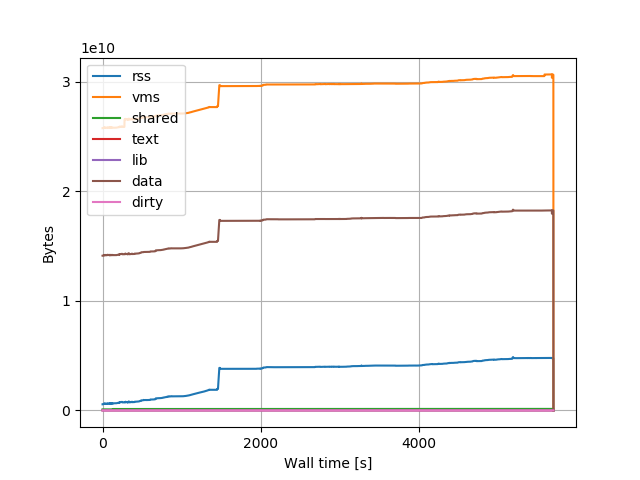

# Monitor Process Memory Use over Time, Plot Result

Install prerequisites:
```
pip install psutil
```

Create log:
```
monitor-process-mem run -o mem-use.log -- some-command --some-option
```

There's also a `monitor` subcommand that lets you monitor a specific PID.

Plot:
```
monitor-process-mem plot -o mem-use.png mem-use.log
```
Gives you a plot like this:


Hat tip to Alex Barnett's similar project [memorygraph](https://github.com/ahbarnett/memorygraph).
